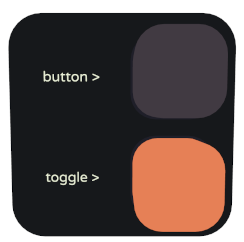
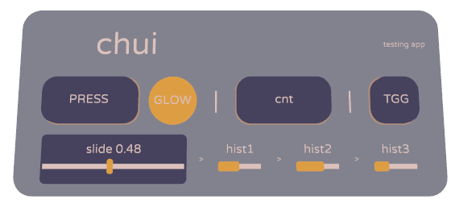
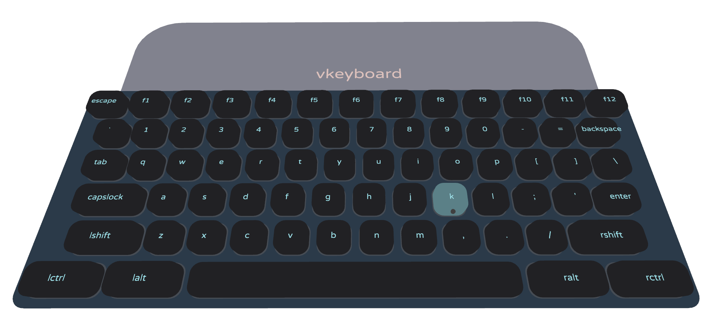
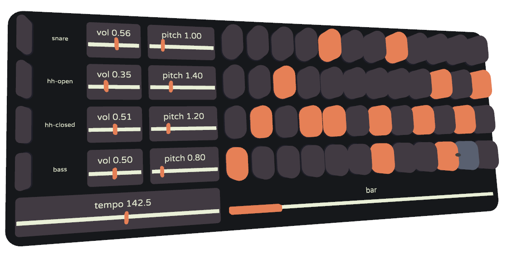

# chui

## Description

`chui` is a small UI library for the [LÖVR](https://github.com/bjornbytes/lovr) framework,
exploring the VR manipulation of UI. Instead of laser pointers, users reach out and push the UI
elements using their finger tips or controllers. Elsewhere called diegetic UI, or Direct Touch
method. chui stands for *c*ompact *h*aptic *u*tility *i*nterlink, and is so tiny it has to be
written in lowercase.

The UI is handled in retained mode - you create panels & add widgets only once during UI
initialization. Stored references to widgets and panels can be modified in runtime as needed. For an
immediate mode UI library check out [lovr-ui](https://github.com/immortalx74/lovr-ui).

```lua
chui = require'chui'

panel = chui.panel()
panel:label { text = 'hello world' }
panel:layout() -- aligns widgets in vertically centered rows

panel.pose:set(0, 1.5, -2, math.pi, 0,1,0) -- rotate panel to face us

-- update not needed for passive label
function lovr.draw(pass)
  chui.draw(pass)
end
```

UI elements are controlled with left & right VR controller, the index fingertips if hands are
tracked, or with the mouse. UI elements are operated with the right mouse button (because the LÖVR
VR simulator uses the left mouse button to rotate the camera).

### Layout

Panel is a container for one or more widgets. It can optionally (by default) render its back side.

The panel stores a list of vertically centered rows, each row is filled with widgets.

```lua
panel = chui.panel()
panel:label{ text = 'button >' }
panel:button()
panel:row()
panel:label{ text = 'toggle >' }
panel:toggle()
panel:layout()
```

At the end of panel definition, the `layout()` function is called to arrange widgets.



All Widgets have the height of 1 *unit*. Each widget gets allocated horizontal space inside its row.
More or less space can be requested by the `span = 2` in widget init table. Each row is vertically
centered inside the panel. Layout function also calculates the overall panel dimensions for the
frame rendering.

This simple and flexible layout scheme has one downside - the 'columns' inside each row don't align
automatically, so it is not a true table grid. Sometimes spacers are needed to adjust the vertical
alignments between two rows.

Skipping this layout method also works. Widgets can also just be manually positioned by modifying
their `.pose` matrix, which is relative to the panel's own `.pose`. Note that widgets should be
oriented in +Z direction to face away from the panel.

### Options

When creating the panel, we can specify some parameters:

```lua
chui.panel{ frame = false, palette = chui.palettes[3] } -- frame=false omits drawing the back-panel 
```

The library has few widgets, with listed parameters and their defaults:

- spacer - blank space widget for aligning other widgets

  `{ span = 1 }`

- label - simple centered text

  `{ text = '', text_scale = 1, span = 1 }`

- button - push button with callback function

  `{ text = '', thickness = 0.3, callback = nil, span = 1 }`

- toggle - on / off button with state-changed callback

  `{ text = '', thickness = 0.3, state = false, callback = nil, span = 1 }` 

- glow - a LED showing on/off state, with optional label on it

  `{ text = '', thickness = 0.1, state = false, span = 1 }`

- progress - a horizontal bar representing a numerical value

  `{ text = '', value = 0, span = 1 }`

- slider - horizontal knob that controls a numerical value

  `{ text = '', min = 0, max = 1, value = 0, step = nil, thickness = 0.15, callback = nil, span = 1 }`


## Dependencies

`chui` uses cutting-edge lovr features (`roundrect`!) which currently only exist on the `dev`
branch. There are available build artifacts in lovr's Github Actions section.

## Demos & utilities

##### testapp

A collection of all the widgets for testing the library and a basic palette switcher/editor.

Color editing is enabled with *F1*, this brings up the orb with edited color.

*F3* selects which color in palette is currently edited

Using horizontal and diagonal gestures (trigger + motion or right mouse + motion), the color is
modified across the hue, saturation and lightness axes.

When done editing the palette, press *F4* to print out your fancy new palette in the console.

*F2* cycles through predefined palettes.



The included `colorizer.lua` library has some useful color conversions for HSL and hexcode formats.

##### vkeyboard

A basic virtual keyboard and a text entry field.



The `vqwerty.lua` is reusable module that creates the virtual keyboard panel. The pressed keys are
registered as key events in `lovr`. Code is easily adaptable to numpad or any custom keyboard
layout.

##### sequencer

A music sequencer with 4 drum tracks and per-track volume & pitch control.



## Contributing

Let me know what could be simpler and what's missing.

Issues & code contributions are always welcome!

## License

The project falls under MIT license.
