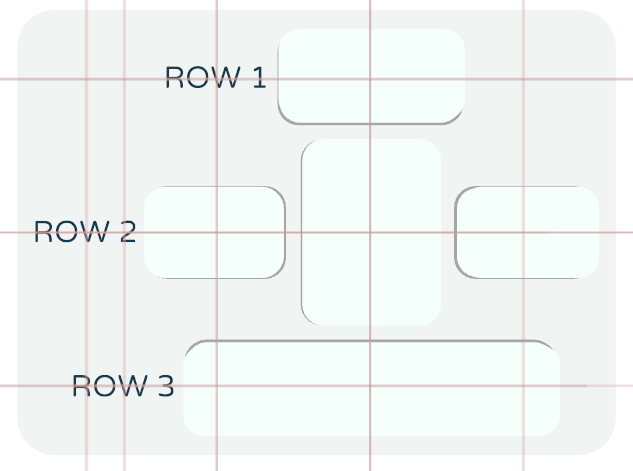

# chui - immersive 3D UI library

`chui` is a library for 3D user interfaces within the [LÖVR](https://github.com/bjornbytes/lovr)
framework for both desktop and VR environments. Moving beyond the flat UIs and laser-pointer VR
interaction, chui widgets are interacted with by pressing and pushing with natural movements. This
immersive approach is elsewhere known as diegetic UI or Direct Touch.


The main library goal is for simple user code to build attractive interfaces that can serve a wide
range of applications: main menu selections, configuration screens, toolbars, as well as interactive
elements within virtual worlds. chui stands for **c**ompact **h**aptic **u**tility **i**nterlink.

chui uses retained mode for UI state - you create panels & add widgets only once during UI
initialization. Stored references to widgets and panels can be modified in runtime as needed. If you
are instead interested in an immediate mode UI library for LÖVR, check out the
[lovr-ui](https://github.com/immortalx74/lovr-ui).

```lua
chui = require'chui'                  -- the entire lib is in a single `chiu.lua` file

panel = chui.panel()                  -- panel is a container for widgets arranged in rows
panel.pose:set(0, 1.5, -2):scale(0.2) -- positioning the panel in 3D space (see lovr's mat4)

panel:label{ text = 'Hello!' }
panel:row()                           -- finish the 1st row and start a new row of widgets
panel:button{ text = 'click me',
  callback = function(self)
    self.text = 'clicked'
  end}

panel:layout()                        -- needs to be called after all the widgets are inserted

function lovr.update(dt)
  chui.update(dt)                     -- let UI process the pointer interactions
end

function lovr.draw(pass)
  chui.draw(pass)                     -- render to screen
end
```

In VR the UI elements are controlled with left & right controller, or with your hand-tracked index
finger tips. On desktop, the UI interaction uses right mouse button. This is because the LÖVR VR
simulator already binds the left mouse button for camera rotation.

## The panel

Panel acts as a container for one or more widgets. It handles:

* own position/scale/orientation in world through its `.pose` mat4 property
* arranging (layouting) the widgets inside its relative coordinate space
* pointer world -> local transitions during the update
* assigning the color scheme to the contained widgets
* drawing of contained widgets and its own frame

## Layout mechanics

The layout mechanics are made simple and predictable. The outer elements resize to fit inner
elements. The widgets are grouped into rows or into nested panels.

The basic organization lays out the widgets into neat rows, top to down. A row expands horizontally
to fit all of its contained widgets laying them side by side from left to right. The row's width is
set to the sum of all the widget widths, its height is set to the height of the tallest widget.
The rows are laid out one below the other. Panel's width is set to the width of the widest of the
rows and panel's height is set to the sum of all row heights.

```lua
panel = chui.panel()
panel.pose:set(0, 0, -3)
panel:label{ text = 'button >' }
panel:button{ span = {2, 1} }
panel:row()                       -- start of a new row
panel:label{ text = 'toggle >' }
panel:toggle()
-- at this point all widgets are centered on the panel, overlapping each other; panel is tiny
panel:layout()
-- widgets are now laid out in 2x2 arrangement; panel resizes to fit them
```


By default the rows are centered horizontally and the widgets are centered vertically within their
rows. This alignment can be changed through parameters to panel layout function, and also further
controlled through the use of nested panels. The **nested-alignment** interactive example may help
with understanding how the row-based alignment works.



Widgets can request less or more space using the `span = {horizontal, vertical}` parameter in their
initialization table. Note that widget size is manually defined and widgets won't automatically
adjust to text length or other content size. Users are responsible for ensuring sufficient space is
allocated for text or other content within the widget.

In case the built-in layout mechanism is not flexible enough, widgets can be positioned manually
by specifying relative offsets to the panel center in each widget's `.pose` mat4 instance. All
widgets should be oriented in +Z direction; with this convention they face outwards from the panel.
It is also necessary to specify panel's dimensions in `.span` table, if the back-panel is rendered
or if the panel is intended to be nested.

#### Nesting of panels

The panels can be nested within each other. A nested panel behaves like any other widget in the
parent panel. Parent will use the dimensions (specified in its `.span`) of nested panel during the
layout, to reserve its place among other elements.


This is an advanced feature that can be used to compose complex components that act as a single
widget. For example, a checkbox can be constructed from a small toggle button and a label next to
it; this combination can then be nested in other panels behaving like a single built-in widget. See
the example additional widgets included under `/widgets` dir.

Nesting panels can also be used for finer control over the layout. Each sub-panel can have its own
horizontal/vertical alignment settings while the parent panel has its own settings. This allows for
more precise positioning in column-based layouts, each column being a nested panel.

The nested panels can specify their own color palettes to design diverse and interesting visual
interfaces. One example is to make every odd row have a different background tint for better
readability; another useful case is making some buttons stand out.

## chui API

`chui.draw(pass, draw_pointers)` renders all created panels in the 3D scene. If `draw_pointers` is
`true`, a small sphere will be rendered for each pointer device, with its position projected onto
the panel surface. User can also call the `panel:draw(pass)` method on individual panels for finer
control over rendering.

`chui.update(dt)` processes pointer interactions across all panels. User can also call the
`panel:update(dt)` method on individual panels.

`chui.setFont(nil or font_path or font_object)` changes the font used for all text rendered by the
library.

`chui.reset()` releases references to created panels.

`chui.initWidgetType(widget_name, widget_proto)` is an advanced feature to register a new widget for
usage with chui. The `widget_name` is a string that is later used to create new widgets (e.g.
`panel:widget_name{ }`). `widget_proto` is a table containing implementations of custom widget's
`:init(options)`, `:draw(pass)` and `:update(dt)` methods.

### Panel API

Both panels and widgets accept an options table to customize their appearance or behavior. Below,
each entry includes the default values (equivalent to using an empty table `{}`).

```lua
panel = chui.panel{ pose = mat4(), frame = 'backpanel', palette = chui.palettes[1] }
```
* the pose sets the position, scaling and orientation of the panel in 3D space; for nested panels
only the scale is preserved during the parent panel layout process
* use `frame = false` to prevent rendering of the rounded back panel frame
* chui library includes a number of built-in palettes, and color scheme can be further customized
with the included *palette-designer* app

`panel:draw(pass, draw_pointers)` renders a single panel at position assigned by its `pose`. Only
top-level (non-nested) panels should be manually drawn; nested panels are automatically rendered as
part of their parent's draw process.

`panel:update(dt)` updates interactive widget states within the panel, using any active pointers
for input. Only top-level (non-nested) panels should be manually updated; nested panels
will be automatically update as part of their parent update process.

`panel:reset()` removes all added widgets, allowing the same panel instance be populated with a new
set of widgets.

`panel:row()` ends the current row and adds a fresh row at the bottom of the panel. New widgets and
nested panels are added to this new row.

`panel:nest(child_panel)` embeds a child panel within the current panel, treating it like any other
widget. Just like adding any other widget, the child panel gets added to the end of last row.

`panel:layout(horizontal_alignment | nil, vertical_alignment | nil)` arranges widgets and nested
panels to prevent overlap, calculating the panel's overall dimensions span. It is typically called
at the end of the panel initialization, after all widgets are added, but can also be invoked
whenever the panel's arrangement changes.

The `horizontal_alignment` parameter (`left`, `right`, or default `center`) dictates the alignment
of multiple rows within the panel. Similarly, `vertical_alignment` (`top`, `bottom`, or default
`center`) controls the alignment of widgets within a single row.

The horizontal and vertical alignment also influence the panel's positioning relative to its
assigned pose. For instance, a top-aligned panel is positioned relative to its top edge and
extends downwards. Conversely a bottom-right aligned panel extends upwards and leftwards from its
fixed bottom-right corner.

The panel object provides constructor methods for each widget type, that are used to add widgets.
The widgets always get added to the end of last row. A list of these constructor methods follows.

### Widgets API

In addition to the specific widget options listed below, each widget can accept a
`span = {horizontal, vertical}` which controls the allocated space during the layout operation.
The default span for all widgets is `{1, 1}`. You can also specify only the horizontal span (e.g.
`span = 2`).

**Spacer** is an invisible non-interactive element used to create empty space or push other widgets
apart, affecting the panel size. It has no additional options beyond the mentioned `span`.

```lua
panel:spacer{}
```

**Label** is a simple non-interactive text, with controllable font size.

```lua
panel:label{ text = '', text_scale = 1 }
```

**Button** is a momentary push-button widget. The optional callback function is called with
  `(self)`, where `self` is a reference to the pressed button widget. Besides using callback, users
  can call `my_button:get()` to poll the current state of the button.

```lua
panel:button{ text = '', thickness = 0.3, callback = nil }
```

**Toggle** is a latching toggle button widget. The optional callback function is called with
`(self, state)`. Besides interacting with widget and assigning the callback, users can call
 `toggle:set(true_or_false)` and `current_state = toggle:get()` to set or poll the binary state.

```lua
panel:toggle{ text = '', thickness = 0.3, state = false, callback = nil }
```

**Glow** is a non-interactive indicator of its boolean state, being lit up when true. The widget has
`:get()` and `:set(true_or_false)` methods.

```lua
panel:glow{ text = '', thickness = 0.1, state = false }
```

**Progress** is a non-interactive visualizer of a numerical value in range from 0 to 1. It has the
`:get()` method, and a `:set(normalized_value)` method which will also clamp the input value to
supported range.

```lua
panel:progress{ text = '', value = 0 }
```

**Slider** is visual component for modifying a numerical value. The `step` option (for example
`step=0.25`) specifies granularity; use `step=1` for integer slider. The `format` string is an
advanced option to customize the appearance of slider label; mainly to control the number of digits
displayed.

The optional callback function is called with `(self, value)` parameters, either when the user stops interacting with the widget (`live_update=false`) or whenever the value changes (
`live_update=true`). Slider widget also has `:get()` and `:set(value)` methods.

```lua
panel:slider{ text = '',  format = '%s %.2f', min = 0, max = 1, value = 0, step = nil, thickness = 0.15, callback = nil, live_update = true }
```

---

Those few widgets are the only ones built into `chui` itself - a basic set for common interactions.
Custom widgets can be implemented outside the chui source and integrated into the lib with the
`initWidgetType` function. A widget could be anything that fits the UI paradigm, from rendering a
textured plane (a minimap) to audio oscilloscope or a virtual thumbstick. Some compound widgets can
be found in `/widgets` source dir.

## Demos & utilities

##### showcase app

A collection of all the built-in widgets, for testing the library and as a learning reference.

##### nested-alignment


The sample app constructs 5x5 randomly sized toggle-buttons and offers 9 ways to align them. It
demonstrates the nesting of a panel within another and the alignment mechanics. Note how the top
and bottom alignment works per-row, while left and right options align the entire rows without
changing the relative positions of widgets within the row.

The shown layout demonstrates that the widgets are not vertically aligned between rows, because
they have different horizontal spans. When vertical alignment is necessary, each column should be a
nested table (with the desired 'left' / 'right' / 'center' alignment).

##### palette-designer

A color palette designer for previewing and modifying chui color palettes. Select one of built-in
color palettes, see the preview for all built-in widgets, dynamically edit colors with HSL sliders,
and print out the palette table to the console output.


The included `colorizer.lua` code also has some useful color conversion utilities between HSL, RGB table and hexcode formats for storing color.

##### vkeyboard

A full 3D virtual keyboard and a basic text edit box.


The `vqwerty.lua` is reusable module that creates the virtual keyboard panel. The pressed keys are
registered as key events in LÖVR, so they should work out-of-the-box with any LÖVR project that
consumes the hardware keyboard events. The layout is also easily adaptable to a numpad or any other
keyboard arrangement.

##### sequencer

An example of complete app in LÖVR + chui, a basic music drum sequencer with 4 tracks and per-track
volume & pitch control. The VR mode is disabled and the UI is configured to work in 2D desktop mode
with orthographic projection, dynamically adaptating when the window resizes.


## Contributing

Let me know what could be made simpler and what's missing in your usage.

Issues & code contributions are always welcome!

## License

The project falls under MIT license.
